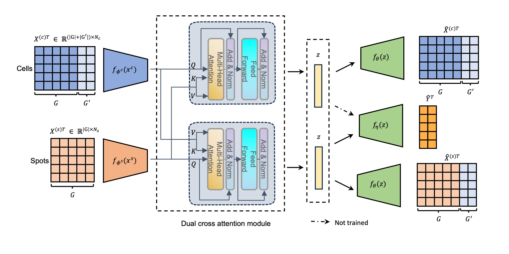

# Cross-modal imputation and uncertainty estimation for spatial transcriptomics
This repository contains the source code for [paper](https://openreview.net/forum?id=7QZ65OECUt): Cross-modal imputation and uncertainty estimation for spatial transcriptomics. Our methods was developed based on [scvi-tools](https://docs.scvi-tools.org/en/stable/tutorials/index_dev.html).



## Running the model
```
usage: run_main.py [-h] [--experiment_name EXPERIMENT_NAME] [--data_path DATA_PATH] [--data_id DATA_ID] [--batch_size BATCH_SIZE] [--seed SEED]
                   [--out_file_path OUT_FILE_PATH] [--gpu_device GPU_DEVICE] [--use_gpu] [--lr LR] [--CL_weight CL_WEIGHT] [--epochs EPOCHS] --generative_dist
                   GENERATIVE_DIST [GENERATIVE_DIST ...] --model_library_size MODEL_LIBRARY_SIZE [MODEL_LIBRARY_SIZE ...] [--topK_contrastive TOPK_CONTRASTIVE]
                   [--corr_metric CORR_METRIC] [--latent_dim LATENT_DIM] [--n_encoder_layers_individual N_ENCODER_LAYERS_INDIVIDUAL]
                   [--n_encoder_layers_shared N_ENCODER_LAYERS_SHARED] [--dim_hidden_encoder DIM_HIDDEN_ENCODER] [--n_encoder_neurons N_ENCODER_NEURONS]
                   [--n_decoder_layers_individual N_DECODER_LAYERS_INDIVIDUAL] [--n_decoder_layers_shared N_DECODER_LAYERS_SHARED]
                   [--dim_hidden_decoder_individual DIM_HIDDEN_DECODER_INDIVIDUAL] [--dim_hidden_decoder_shared DIM_HIDDEN_DECODER_SHARED]

imputeST model

optional arguments:
  -h, --help            show this help message and exit
  --experiment_name EXPERIMENT_NAME
  --data_path DATA_PATH
                        Input data path
  --data_id DATA_ID     data indentifier
  --batch_size BATCH_SIZE
                        number of batch_size
  --seed SEED           random seed for reproducibility
  --out_file_path OUT_FILE_PATH
                        Output file path for saving results
  --gpu_device GPU_DEVICE
  --use_gpu
  --lr LR
  --CL_weight CL_WEIGHT
                        contrastive loss weight
  --epochs EPOCHS
  --generative_dist GENERATIVE_DIST [GENERATIVE_DIST ...]
                        generative distribution for sc and st data
  --model_library_size MODEL_LIBRARY_SIZE [MODEL_LIBRARY_SIZE ...]
                        whether to model library size
  --topK_contrastive TOPK_CONTRASTIVE
                        TopK cells/spots pairs to sample from
  --corr_metric CORR_METRIC
                        Metrics to calculate correlation in the cosine similarity matrix
  --latent_dim LATENT_DIM
  --n_encoder_layers_individual N_ENCODER_LAYERS_INDIVIDUAL
  --n_encoder_layers_shared N_ENCODER_LAYERS_SHARED
  --dim_hidden_encoder DIM_HIDDEN_ENCODER
  --n_encoder_neurons N_ENCODER_NEURONS
  --n_decoder_layers_individual N_DECODER_LAYERS_INDIVIDUAL
  --n_decoder_layers_shared N_DECODER_LAYERS_SHARED
  --dim_hidden_decoder_individual DIM_HIDDEN_DECODER_INDIVIDUAL
  --dim_hidden_decoder_shared DIM_HIDDEN_DECODER_SHARED
```

### Example running script
we recommend user to tune the contrastive weight and batch size as their own needs.
```
python run_main.py --generative_dist zinb nb --model_library_size False False --latent_dim 20 --topK_contrastive 50 --CL_weight 5 --corr_metric Cosine --use_gpu --gpu_device cuda:0
```


## Spatial location recovery
Spatial location recovery demo notebook for our method is available at: [spatial recovery](./src/pos_recovery.ipynb).

## Baseline methods
The **baselines/** folder wrap up the baseline methods in `imputation` and `spatial location recovery` respectively.

* Baseline imputation script:
```
imputation/
├── gimVI.ipynb
├── naive_baseline.ipynb
├── run_envi_cv_ctx.py
├── run_tangram.ipynb
└── SpaGE_CV.ipynb
```
* Spatial location recovery script:
```
pos_recovery/
├── CeLEry_seqFISH.ipynb
└── scSpace_seqFSIH.ipynb
```
